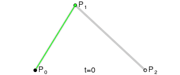

# 贝塞尔曲线
Bézier curve(贝塞尔曲线)是应用于二维图形应用程序的数学曲线。 曲线定义：起始点、终止点（也称锚点）、控制点。通过调整控制点，贝塞尔曲线的形状会发生变化。

原理和简单推导（以二阶为例）：

设 $P_0$、$P_0^2$、$P_2$是抛物线上的3个点。过 $P_0$ 和 $P_1$点的两切线交于$P_1$点，在$P_0^2$的切线交 $P_0P_1$ 和 $P_2P_1$ 于 $P_0^1$ 和 $P_1^1$，则如下比例成立：
$$\dfrac{P_0P_0^1}{P_0^1P_1}=\dfrac{P_1P_1^1}{P_1^1P_2}=\dfrac{P_0^1P_0^2}{P_0^2P_1^1}$$
这是所谓的抛物线三切线定理。

当$P_0$，$P_2$固定,引入参数$t$,令上述比值为$t:(1-t),t\in[0,1]$,即有:
$$\begin{aligned}
    P_0^1=(1-t)P_0+tP_1 \\
    P_1^1=(1-t)P_1+tP_2 \\
    P_0^2=(1-t)P_0^1+tP_1^1
\end{aligned}$$

当$P_0$，$P_1$，$P_2$坐标已知时，就有:
$$P_0^2(t)=(1-t)^2P_0+2t(1-t)P_1+t^2P_2,t\in[0,1]$$
此时,$P_0^2$是关于t的函数。而当t从0变为1时，它表示了由顶点$P_0$、$P_1$、$P_2$定义的一条二次ezier曲线。

同理也可以的出三阶贝塞尔曲线：
$$B(t)=P_0(1-t)^3+3P_1t(1-t)^2+3P_2t^2(1-t)+P_3t^3,t\in[0,1]$$

==>一般公式：
给定点$P_0、P_1、...、P_n$，则其赛贝尔曲线为：
$$B(t)=\sum_{i=0}^nC_n^iP_i(1-t)^{n-i}t^i,\\其中C_n^i=\dfrac{n!}{i!(n-i)!}$$

4阶曲线

5阶曲线

### 根据曲线经过的点拟合出该贝塞尔曲线的顶点
以二阶贝塞尔曲线为例。
下面是二阶贝塞尔曲线的计算式子：
$$B(t)=(1-t)^2P_0+2t(1-t)P_1+t^2P_2,t\in[0,1]$$
写成矩阵的形式就是：
$$B=TP$$
其中，$T=\begin{pmatrix} (1-t_1)^2 & 2t_1 & t_1^2\\ (1-t_2)^2 & 2t_2 & t_2^2 \\ ... \\ (1-t_n)^2 & 2t_n & t_n^2 \end{pmatrix}_{n*3}$，$P=\begin{pmatrix} P_1^x & P_1^y \\ P_2 & P_2^y \\ P_3 & P_3^y \end{pmatrix}_{3*2}$,$B=\begin{pmatrix} B_1^x & B_1^y \\ B_2 & B_2^y \\ ... \\ B_n & B_n^y \end{pmatrix}_{n*2}$。

若n=3，直接解方程，$P=T^{-1}B$;
若n>3，可以使用一些拟合方法进行拟合，这里使用最小二乘法进行拟合，即$P=(T^TT)^{-1}T^TB$

若想求三阶或者更高阶的话，只需修改矩阵T即可，其余过程不变。